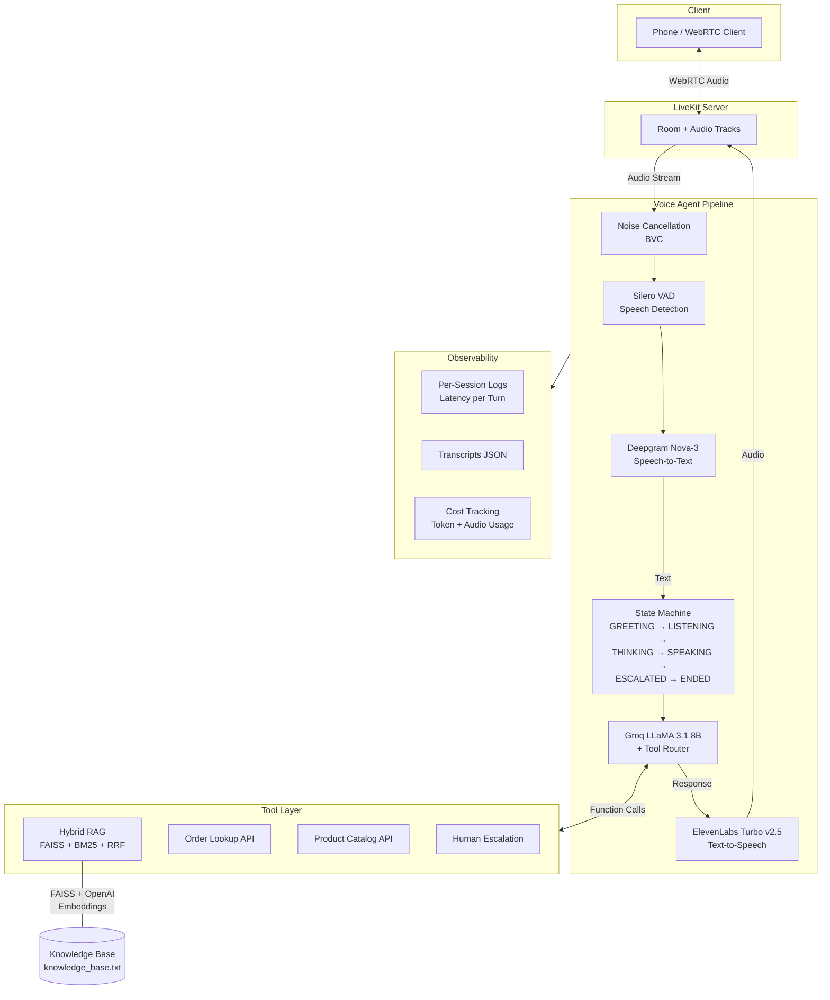

# Customer Support Voice AI Agent

Autonomous voice customer support agent with real-time speech streaming, tool use, RAG retrieval, conversation memory, human escalation, and full observability.

Built with [LiveKit Agents](https://docs.livekit.io/agents/), Groq, Deepgram, ElevenLabs, and FAISS.

## Architecture



## Latency Benchmarks

Measured from real sessions. TTFA = Time To First Audio (user stops speaking → agent audio begins).

| Stage | Target | Typical | Notes |
|-------|--------|---------|-------|
| VAD (end-of-utterance) | 15-30ms | 20-50ms | Silero VAD, 0.6 threshold |
| STT (transcription) | 200-600ms | 300-500ms | Deepgram Nova-3, streaming |
| LLM (time to first token) | 100-500ms | 200-500ms | Groq LLaMA 3.1 8B |
| TTS (time to first byte) | 100-300ms | 150-400ms | ElevenLabs Turbo v2.5 |
| **TTFA (first audio)** | **<1000ms** | **500-1200ms** | **VAD + LLM TTFT + TTS TTFB** |
| Full pipeline | <2000ms | 1000-2500ms | End-to-end per turn |

### Cost Per Session (typical 3-min call)

| Service | Rate | Typical Cost |
|---------|------|-------------|
| LLM (Groq) | $0.05/1M input, $0.08/1M output | ~$0.0002 |
| STT (Deepgram) | $0.0043/min | ~$0.013 |
| TTS (ElevenLabs) | $0.30/1K chars | ~$0.006 |
| **Total** | | **~$0.02/call** |

## Quick Start

```bash
# Install uv (if not installed)
pip install uv

# Install dependencies
uv sync

# Copy env and fill in your keys
cp .env.example .env

# Run the agent
uv run python agent.py dev
```

## Project Structure

```
├── agent.py                 # Entry point (thin wrapper)
├── app/
│   ├── main.py              # Agent entrypoint, session lifecycle, event handlers
│   ├── config.py            # Centralized configuration
│   ├── state_machine.py     # Conversation states + memory + escalation detection
│   ├── tools.py             # LLM function tools (RAG, orders, products, escalation)
│   ├── rag.py               # Hybrid retrieval: FAISS + BM25 + RRF re-ranking
│   └── dummy_apis.py        # Mock order DB + product catalog
├── knowledge_base.txt       # Product specs, policies, FAQs for RAG
├── pyproject.toml           # uv/pip dependencies
├── logs/                    # Per-session latency + cost logs
└── transcripts/             # Per-session conversation JSON
```

## Features

- **Realtime speech streaming** — LiveKit WebRTC with Silero VAD for interrupt detection
- **Conversation state machine** — GREETING → LISTENING → THINKING → SPEAKING → ESCALATED → ENDED
- **Hybrid RAG** — FAISS semantic search (OpenAI embeddings) + BM25 keyword search, merged via Reciprocal Rank Fusion
- **Tool use** — 7 function tools: knowledge search, order lookup (by ID/phone/email), product specs, product listing, human escalation
- **Memory** — Short-term conversation history tracked per session, fed as context
- **Human escalation** — Keyword detection + explicit tool; triggers on customer request or unresolvable issues
- **Interrupt handling** — Configurable VAD thresholds, false interruption recovery, barge-in support
- **Observability** — Per-turn latency breakdown (VAD/STT/LLM/TTS/TTFA), token usage, cost estimation, session transcripts

## Environment Variables

| Variable | Description |
|----------|-------------|
| `LIVEKIT_URL` | LiveKit server WebSocket URL |
| `LIVEKIT_API_KEY` | LiveKit API key |
| `LIVEKIT_API_SECRET` | LiveKit API secret |
| `GROQ_API_KEY` | Groq API key (LLM) |
| `DEEPGRAM_API_KEY` | Deepgram API key (STT) |
| `ELEVEN_API_KEY` | ElevenLabs API key (TTS) |

| `OPENAI_API_KEY` | OpenAI API key (embeddings for RAG) |
